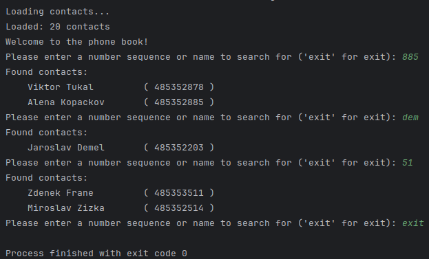

# T9 Number Finder (EN)
This project implements a contact management system with a focus on efficient search
functionality. The system uses a suffix tree data structure to allow rapid
searching of contacts by T9 representation of their names, which is
particularly useful for applications such as caller apps on smartphones or
other contact-based applications.

## Description
The contact management system provides a way to store contact information and
retrieve contacts using partial T9 number sequences that correspond to the letters
in their names. This is achieved through the use of a suffix tree that indexes
the T9 representations for fast lookups.

## Image


## Installation

### Using CMake
To build the project with CMake, follow these steps:

1. Ensure that CMake is installed on your system.
2. Clone the repository to your local machine.
3. Navigate to the project directory.
4. Create a new directory for the build files:

    ```shell
    mkdir build && cd build
    ```

5. Run CMake to generate the build system:

    ```shell
    cmake ..
    ```

6. Build the project:

    ```shell
    cmake --build .
    ```

7. The executable will be generated in the `build` directory.

### Using g++

Alternatively, if you prefer to manually compile the project using `g++`, follow these steps:

1. Clone the repository to your local machine.
2. Navigate to the project directory.
3. Compile the source code using `g++` with C++17 support:
    ```shell
    g++ -std=c++17 -o contact_manager 
          src/loaders/CPhoneLoader.h
          src/loaders/CPhoneLoader.cpp
          src/loaders/CCSVLoader.h
          src/loaders/CCSVLoader.cpp
          src/loaders/CPhoneLoaderFactory.h
          src/loaders/CPhoneLoaderFactory.cpp
          src/exception/FileNotFoundException.h
          src/exception/FileNotFoundException.cpp
          src/CContact.h
          src/CContact.cpp
          src/exception/UnknownFileTypeException.h
          src/exception/UnknownFileTypeException.cpp
          src/user_interface/CUserInterface.h
          src/user_interface/CUserInterface.cpp
          src/CContactManager.h
          src/CContactManager.cpp
          src/data_structures/CSuffixNode.h
          src/data_structures/CSuffixNode.cpp
          src/data_structures/CSuffixTree.h
          src/data_structures/CSuffixTree.cpp
    ```
4. Run the executable:
    ```shell
    ./contact_manager
    ```
   
## Usage

To use the contact management system, execute the compiled binary. The system allows you to add new contacts, search existing contacts by T9 sequence, and manage contact data efficiently.

## Contributing

Contributions are welcome. Please feel free to fork the repository, make changes, and submit pull requests. For major changes, please open an issue first to discuss what you would like to change.

## License

This project is licensed under the MIT License.

## Contact

For any inquiries, please reach out to Daniel Adámek at daniel.adamek@tul.cz.